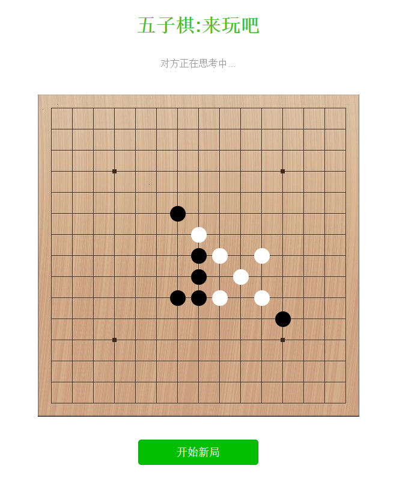
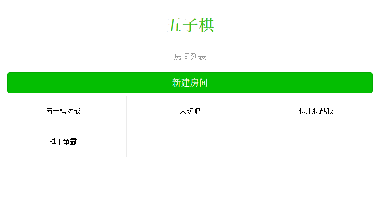
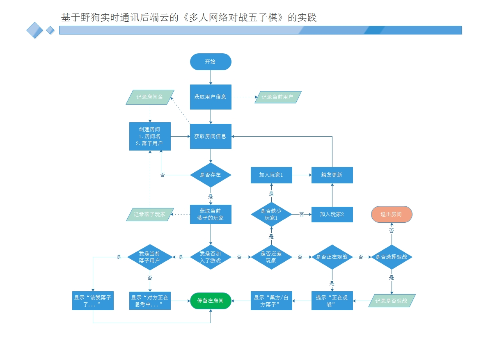

# 试玩 
#### [详细信息](https://fengmu456.github.io/gobang)
#### [开始游戏](https://fengmu456.github.io/gobang/rooms.html)

## 游戏画面截图

### 采用的技术和库
- **野狗实时通云后端**
[访问官网](https://www.wilddog.com/)
> 国内的一个提供多端实时通讯服务的产品，能够在不写后端代码的情况下，实现多端多设备实时通讯。

- **Vue.js**
[访问官网](http://cn.vuejs.org/)
> 只用了非常少的一点，几乎算是没有。没了解过的话，看代码也能够理解

- **jQuery.js**
> 相信这个已经见怪不怪了

- **jquery-weiui**
> 前端UI库，轻，适合移动端（我做这个程序时对U没多在意，随便找了一个来用）

## 游戏房间初始化主逻辑
######就只有这一点图，其他的懒的画了，画这个的原因是因为房间初始化逻辑的游戏主循环中，逻辑分支较多，为了理清思路。
